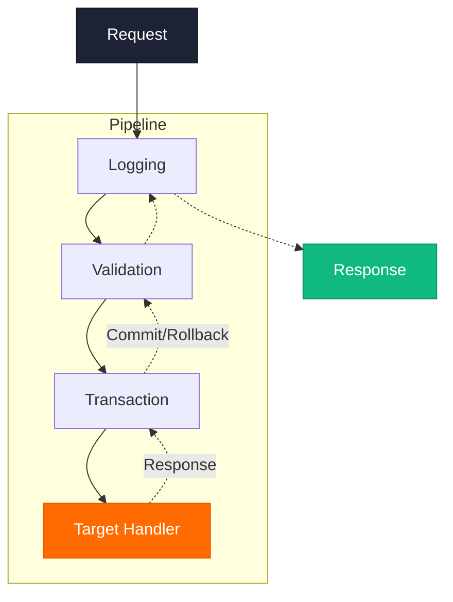
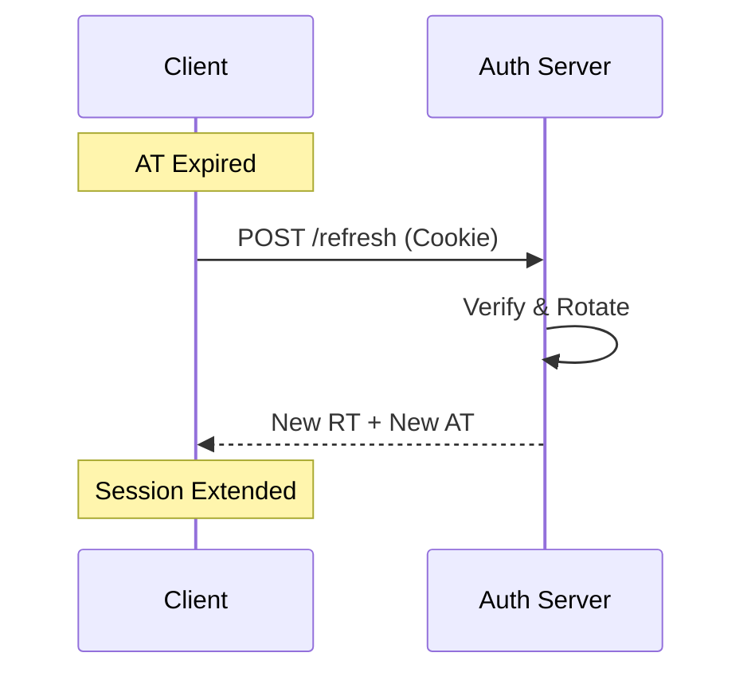

LexiVocab

<h1 class="cover-tagline text-left max-w-3xl" v-motion :initial="{ opacity: 0, x: -30 }" :enter="{ opacity: 1, x: 0, transition: { delay: 300, duration: 800 } }">
Xây dựng hệ thống học từ vựng đa nền tảng tích hợp   thuật toán <u> lặp lại ngắt quãng</u>
</h1>

Ứng dụng thuật toán Spaced Repetition SuperMemo-2 và AI sinh tạo để mang lại trải nghiệm liền mạch, tập trung.

Phan Văn Thành

Sinh viên thực hiện (DTH225766)

Ths. Nguyễn Thái Dư

Giảng viên hướng dẫn

<!--
Kính chào quý thầy cô trong Hội đồng. Em là Phan Văn Thành, mã sinh viên DTH225766. Hôm nay em rất vinh dự được trình bày đồ án tốt nghiệp với đề tài: LexiVocab - Hệ sinh thái học từ vựng đa nền tảng tích hợp thuật toán lặp lại ngắt quãng. Dự án ứng dụng thuật toán SuperMemo-2 và AI sinh tạo để mang lại trải nghiệm học tập tập trung và liền mạch.
-->

---
transition: slide-up
---

TẦM NHÌN DỰ ÁN

<h1 class="animate-fade-up animate-delay-1 mb-2 text-3xl">Mục tiêu đồ án</h1>

Xây dựng sản phẩm hoàn thiện, giải quyết triệt để bài toán học từ vựng của người dùng.

  <!-- Card 1: Multi-platform -->
  

    

      

    

    

      <h3 class="font-bold text-gray-900 mb-0.5 text-sm">Hệ sinh thái Đa nền tảng</h3>
      
Trải nghiệm liền mạch qua Extension, Web & Mobile.

    

  

  <!-- Card 2: Spaced Repetition -->
  

    

      

    

    

      <h3 class="font-bold text-gray-900 mb-0.5 text-sm">SuperMemo-2</h3>
      
Thuật toán tính chu kỳ ôn tập khoa học, cá nhân hóa.

    

  

  <!-- Card 3: AI -->
  

    

      

    

    

      <h3 class="font-bold text-gray-900 mb-0.5 text-sm">AI Sinh tạo</h3>
      
Tích hợp LLM tạo ngữ cảnh, dịch thuật tự động.

    

  

  <!-- Card 4: Production-Ready -->
  

    

      

    

    

      <h3 class="font-bold text-gray-900 mb-0.5 text-sm">Triển khai thực tế</h3>
      
Hệ thống Production-ready, chạy mượt mà trên môi trường thật.

    

  

<BrandFooter section="Mở đầu" />

<!--
Mục tiêu cốt lõi của đồ án không chỉ là một ứng dụng học tập, mà là xây dựng một sản phẩm hoàn thiện (Production-ready). Giải quyết triệt để bài toán học từ vựng qua 4 phương diện: Trải nghiệm đa nền tảng liền mạch; Thuật toán SuperMemo-2 cá nhân hóa; Tích hợp AI sinh tạo để hiểu sâu ngữ cảnh; và triển khai thực tế trên môi trường Production.
-->

---
transition: slide-up
---

RÀO CẢN #1

<!-- Left Side -->

<h1 class="animate-fade-up animate-delay-1 text-4xl leading-tight mb-2">Context Switching</h1>
<h2 class="text-[var(--lv-primary)] mb-6 animate-fade-up animate-delay-2 text-xl font-semibold">Kẻ thù của sự tập trung</h2>

Chuyển đổi qua lại giữa bài báo và ứng dụng từ điển làm đứt đoạn luồng tư duy, tạo ra cảm giác nản chí khi đọc tài liệu ngoại ngữ.

Mất 23 phút

để não bộ lấy lại sự tập trung và quay về trạng thái "Flow" sau mỗi lần gián đoạn.

— Nghiên cứu từ ĐH UC Irvine

<!-- Right Side Visual -->

<!-- Distraction Metric -->

-40%

Hiệu suất

<BrandFooter section="Vấn đề" />

<!--
Rào cản lớn nhất là Context Switching - kẻ thù của sự tập trung. Khi đọc bài báo tiếng Anh gặp từ mới, phải chuyển tab sang từ điển làm đứt đoạn luồng tư duy. Theo nghiên cứu từ ĐH UC Irvine, não bộ mất tới 23 phút để lấy lại trạng thái Flow, làm giảm 40% hiệu suất học tập.
-->

---
transition: fade
---

RÀO CẢN #2

<h1 class="animate-fade-up animate-delay-1 mb-2">Đường cong quên lãng</h1>

Học vẹt không ôn tập dẫn đến lãng phí công sức. Nếu không ôn tập đúng thời điểm, não bộ sẽ tự động loại bỏ thông tin để nhường chỗ cho dữ liệu mới.

  <ForgetCurve />

<BrandFooter section="Vấn đề" />

<!--
Rào cản thứ hai là Đường cong quên lãng Ebbinghaus. Nếu không có cơ chế ôn tập đúng thời điểm, não bộ sẽ tự động loại bỏ 80% thông tin mới chỉ sau 24 giờ. Việc học vẹt mà không có sự nhắc nhở khoa học dẫn đến lãng phí rất lớn công sức của người học.
-->

---
transition: slide-up
---

GIẢI PHÁP

<h1 class="animate-fade-up animate-delay-1 mb-16 text-5xl font-black tracking-tight">Ba Trụ Cột của LexiVocab</h1>

<PillarCard 
number="1" 
title="Bắt từ" 
enTitle="Capture"
icon="i-lucide-scan-line"
desc="Chrome Extension bắt từ vựng trực tiếp trên trang web, không làm gián đoạn luồng đọc và tư duy của bạn."
delay="400" 
/>

<PillarCard 
number="2" 
title="Nhớ lâu" 
enTitle="Remember"
icon="i-lucide-brain"
desc="Thuật toán SuperMemo-2 tối ưu hóa thời gian ôn tập, giúp chuyển thông tin từ bộ nhớ ngắn hạn sang dài hạn."
delay="600" 
/>

<PillarCard 
number="3" 
title="Hiểu sâu" 
enTitle="Understand"
icon="i-lucide-sparkles"
desc="Tận dụng sức mạnh của AI để tạo ngữ cảnh cá nhân hóa, ví dụ thực tế giúp bạn hiểu cặn kẽ mọi tầng nghĩa."
delay="800" 
/>

<BrandFooter section="Giải pháp" />

<!--
LexiVocab ra đời dựa trên 3 trụ cột: Capture (Bắt từ) - Chrome Extension lưu từ trực tiếp không gián đoạn; Remember (Nhớ lâu) - thuật toán SM-2 chuyển thông tin vào bộ nhớ dài hạn; Understand (Hiểu sâu) - AI tạo ngữ cảnh ví dụ thực tế giúp hiểu cặn kẽ mọi tầng nghĩa của từ.
-->

---
layout: cover
class: "!p-0 bg-[#09090B] text-white"
---

<SectionDivider 
number="02" 
title="Hệ Sinh Thái 4 Mảnh Ghép" 
desc="Kiến trúc Hub & Spoke kết nối đa nền tảng, bao phủ 100% không gian thiết bị." 
/>

<!--
Chuyển phần: Hệ sinh thái 4 mảnh ghép, thiết kế theo kiến trúc Hub & Spoke để bao phủ 100% không gian thiết bị của người dùng.
-->

---
transition: fade
---

ARCHITECTURE

<h1 class="animate-fade-up animate-delay-1 mb-4 text-left">Kiến trúc Hub & Spoke</h1>

<HubSpoke />

<BrandFooter section="Hệ sinh thái" />

<!--
Hệ thống lấy Core API (.NET 10) làm trung tâm, kết nối đồng nhất dữ liệu giữa 3 nền tảng Client: Chrome Extension, Mobile App và Web Dashboard. Điều này đảm bảo người dùng có thể bắt từ trên máy tính tại văn phòng và ôn tập ngay trên điện thoại khi đang di chuyển.
-->

---
transition: slide-up
---

CHROME ECOSYSTEM

<h1 class="text-2xl font-black text-slate-900 tracking-tight">Chrome Extension</h1>

Client 01

Instant Capture Engine

<h2 class="text-2xl font-black text-gray-900 mb-4 leading-tight">Bắt từ vựng tức thì, Không gián đoạn.</h2>

01

<strong>Manifest V3:</strong> Chuẩn bảo mật mới nhất, tối ưu hiệu năng và quyền riêng tư.

02

<strong>Shadow DOM:</strong> Cô lập hoàn toàn UI popup khỏi CSS của website hiện tại.

03

<strong>Service Worker:</strong> Xử lý ngầm hiệu quả, tiết kiệm tài nguyên hệ thống.

nytimes.com/article

The serendipity of the moment was not lost on the researchers.
 

serendipity
Noun

"Sự tình cờ may mắn, khám phá ra thứ có giá trị khi không chủ đích tìm kiếm."

<button class="w-full bg-[#1D2235] text-white text-[8px] py-1.5 rounded-lg font-bold hover:bg-black transition-colors">Save to LexiVocab</button>

<BrandFooter section="Hệ sinh thái" />

<!--
Chrome Extension là công cụ bắt từ chủ lực. Manifest V3 mới nhất tối ưu hiệu năng. Shadow DOM cô lập hoàn toàn UI, popup hiển thị đẹp trên mọi website. Service Worker xử lý đồng bộ ngầm tiết kiệm tài nguyên.
-->

---
transition: fade
---

MOBILE ECOSYSTEM

<h1 class="text-2xl font-black text-slate-900 tracking-tight">Mobile Application</h1>

Client 02

Native Experience Engine

<h2 class="text-2xl font-black text-gray-900 mb-4 leading-tight">Học tập liền mạch, Mọi lúc mọi nơi.</h2>

01

<strong>Đồng bộ Real-time:</strong> Dữ liệu từ Extension và Web được đồng bộ tức thì qua Cloud.

02

<strong>SRS Notification:</strong> Thuật toán gửi thông báo ôn bài chính xác vào "thời điểm vàng".

03

<strong>Native Performance:</strong> Trải nghiệm vuốt chạm mượt mà, tối ưu cho cả Android và iOS.

Live Status

 Synced

<BrandFooter section="Hệ sinh thái" />

<!--
Mobile App được xây dựng bằng React Native, mang lại trải nghiệm mượt mà. Điểm nhấn là tính năng SRS Notification - gửi thông báo nhắc ôn bài đúng vào 'thời điểm vàng' mà thuật toán tính toán. Dữ liệu được đồng bộ Real-time qua Cloud, giúp người dùng luôn cập nhật được những từ vựng mới nhất mình vừa bắt được trên trình duyệt.
-->

---
transition: slide-up
---

SYSTEM ARCHITECTURE

<h1 class="text-2xl font-black text-slate-900 tracking-tight">Web Dashboard</h1>

Client 03

Central Management System

01

<strong>Automation:</strong> SePay Webhooks Sync tự động hóa quy trình thanh toán.

02

<strong>SEO & i18n:</strong> Routing đa ngôn ngữ chuẩn quốc tế, tối ưu tìm kiếm.

03

<strong>Analytics:</strong> Biểu đồ trực quan theo dõi tiến độ và hiệu quả ghi nhớ.

lexivocab.store/dashboard

<BrandFooter section="Hệ sinh thái" />

<!--
Web Dashboard trên Next.js, tích hợp SePay Webhooks tự động hóa nâng cấp VIP qua QR code. Biểu đồ Analytics trực quan theo dõi tiến độ và hiệu quả ghi nhớ theo thời gian.
-->

---
layout: cover
class: "!p-0 bg-[#09090B] text-white"
transition: view-transition
---

<SectionDivider 
number="03" 
title="Kiến trúc Backend & Bảo mật" 
desc="Clean Architecture, CQRS, và cơ chế xác thực kép đảm bảo hiệu năng cốt lõi." 
/>

<!--
Chuyển phần: Kiến trúc Backend & Bảo mật. Đằng sau sự liền mạch đó là một nền tảng Backend vững chắc và bảo mật mà em sẽ trình bày ngay sau đây.
-->

---
transition: slide-up
---

ARCHITECTURE

<h1 class="text-3xl font-black text-slate-900 tracking-tight mb-1">Clean Architecture</h1>
<h2 class="text-[#FF6B00] text-lg font-bold mb-4 animate-fade-up animate-delay-2">Core API .NET 10</h2>

Tách biệt logic cốt lõi khỏi framework và cơ sở dữ liệu để tối ưu tính linh hoạt và bảo trì.

<strong>Dependency Rule:</strong> Các dependency chỉ được hướng vào trong. Domain Layer ở trung tâm chứa business logic thuần túy.

 Dễ dàng mở rộng, thay đổi Database mà không cần sửa Core Logic.

<LayerDiagram class="max-h-full" />

<BrandFooter section="Backend" />

<!--
Backend được thiết kế theo Clean Architecture, tách biệt hoàn toàn Business Logic khỏi Framework và Database. Lớp Domain ở trung tâm chứa các quy tắc cốt lõi, giúp hệ thống cực kỳ linh hoạt. Chúng ta có thể thay đổi Database hoặc tích hợp thêm các dịch vụ bên thứ ba mà không cần sửa đổi Logic nghiệp vụ chính.
-->

---
transition: fade
---

DESIGN PATTERN

<h1 class="text-4xl font-black text-slate-900 tracking-tight mb-2 flex items-baseline gap-1">
Command
Query
Responsibility
Segregation
</h1>

Phân tách hoàn toàn luồng xử lý <strong class="text-[#FF6B00] font-semibold">Ghi (Command)</strong> và <strong class="text-blue-500 font-semibold">Đọc (Query)</strong> để tối ưu hóa hiệu năng độc lập và khả năng mở rộng hệ thống.

<!-- Command Side -->

<h3 class="font-black text-xl text-slate-800 leading-tight">Command</h3>

Luồng Ghi Dữ Liệu

 CreateFlashcardCommand

 UpdateReviewResultCommand

<strong class="text-[#FF6B00] block mb-1">Nhiệm vụ:</strong>
Thực thi business logic và validation phức tạp. Ghi trực tiếp vào Primary Database.

<!-- Query Side -->

<h3 class="font-black text-xl text-slate-800 leading-tight">Query</h3>

Luồng Đọc Dữ Liệu

 GetDueFlashcardsQuery

 GetUserStatisticsQuery

<strong class="text-blue-600 block mb-1">Nhiệm vụ:</strong>
Truy vấn tốc độ cao, không có side-effects. Có thể scale mạnh mẽ thông qua Read Replica.

<BrandFooter section="Backend" />

<!--
Em kết hợp mẫu thiết kế CQRS để phân tách hoàn toàn luồng Ghi (Command) và luồng Đọc (Query). Luồng Ghi xử lý các logic phức tạp và validation, trong khi luồng Đọc được tối ưu hóa để truy vấn dữ liệu với tốc độ cao nhất, không gây side-effect, giúp hệ thống dễ dàng scale theo chiều ngang.
-->

---
transition: slide-up
---

MEDIATR

<h1 class="text-3xl font-black text-slate-900 tracking-tight mb-1">MediatR & Pipeline</h1>
<h2 class="text-[#FF6B00] text-lg font-bold mb-4 animate-fade-up animate-delay-2">Xử lý Cross-cutting Concerns</h2>

Điều phối Command/Query đến đúng Handler tương ứng thông qua Middleware Pipeline.

1

LoggingBehavior → Ghi log I/O

2

ValidationBehavior → FluentValidation

3

TransactionBehavior → Auto Commit/Rollback

4

CommandHandler / QueryHandler

<!--
Để điều phối CQRS, em sử dụng thư viện MediatR. Mọi yêu cầu đều đi qua một Pipeline Middleware tập trung, nơi xử lý các vấn đề như: Logging tự động, Validation dữ liệu bằng FluentValidation, và Transaction Management. Điều này giúp code sạch hơn và dễ bảo trì hơn rất nhiều.
-->

---
transition: fade
---

SECURITY MODEL

<h1 class="text-2xl font-black text-slate-900 tracking-tight">Refresh Token Rotation</h1>

Defense Level

Advanced XSS Protection

01 • Access Token (JWT)

Application Memory (RAM)

Hết hạn sau 15 phút — Cô lập hoàn toàn.

02 • Refresh Token

HttpOnly Cookie

Chống XSS 100%. JS không thể truy cập.

<strong>Rotation:</strong> Token cũ bị vô hiệu hóa ngay khi cấp mới, ngăn chặn tuyệt đối Replay Attack.

Silent Refresh Flow

<BrandFooter section="Bảo mật" />

---
transition: slide-up
---

DATA LAYER

<!-- Left Side: Shortened Text -->

Database Design

<h2 class="text-slate-500 text-xs mb-6">Tối ưu truy vấn hàng triệu bản ghi.</h2>

  

<h3 class="font-bold text-slate-800 text-[12px] mb-0.5">PostgreSQL (B-Tree Index)</h3>

Đánh chỉ mục (Index) trên trường <code>Word</code> và <code>NextReview</code>, giúp hệ thống truy vấn lịch ôn tập siêu tốc.

<h3 class="font-bold text-slate-800 text-[12px] mb-0.5">Khử Chuẩn (Denormalization)</h3>

Lưu sẵn <code>WordText</code> ở bảng cá nhân (UserVocab). Không cần lệnh JOIN phức tạp khi render UI.

<!-- Right Side: DB Schema -->

 Users

 Iduuid

Emailvarchar

Roleenum

 MasterVocabs

Word (Idx)varchar

Phoneticvarchar

CefrLevelvarchar

<svg viewBox="0 0 200 40" class="w-full h-full overflow-visible">
<path d="M 45 0 C 45 20, 95 20, 95 40" fill="none" stroke="#3b82f6" stroke-width="1.5" stroke-dasharray="3 3"/>
<polygon points="92,36 98,36 95,42" fill="#3b82f6" />
<text x="62" y="14" fill="#3b82f6" font-size="2" font-weight="bold" font-family="sans-serif">1 : N</text>
<path d="M 155 0 C 155 20, 105 20, 105 40" fill="none" stroke="#10b981" stroke-width="1.5" stroke-dasharray="3 3"/>
<polygon points="102,36 108,36 105,42" fill="#10b981" />
<text x="132" y="14" fill="#10b981" font-size="2" font-weight="bold" font-family="sans-serif">1 : N</text>
</svg>

 UserVocabs

 Iduuid

 UserIduuid

WordText #NO_JOINvarchar

RepetitionCountint

IntervalDaysint

EasinessFactorreal

NextReview #INDEXtime

<BrandFooter section="Backend" />

<!--
Về tầng dữ liệu, em sử dụng PostgreSQL. Để tối ưu cho hàng triệu bản ghi, em đánh chỉ mục B-Tree trên các trường quan trọng như Word và NextReview. Đặc biệt, em sử dụng kỹ thuật Khử chuẩn (Denormalization) - lưu sẵn WordText tại bảng UserVocabs để tăng tốc độ render UI, tránh các lệnh JOIN phức tạp làm chậm hệ thống.
-->

---
layout: cover
class: "!p-0 bg-[#09090B] text-white"
transition: view-transition
---

<SectionDivider 
number="04" 
title="Use-Cases & Xử lý tải" 
desc="Thuật toán lõi, tối ưu truy vấn Database, và kỹ thuật Streaming AI." 
/>

<!--
Chuyển phần: Use-Cases & Xử lý tải. Sau đây là cách hệ thống xử lý các tác vụ thông minh và tối ưu hóa hiệu năng thực tế.
-->

---
transition: slide-up
---

CORE ALGORITHM

<!-- Left Side: Algorithm & Math -->

Spaced Repetition

<h2 class="text-slate-500 text-xs mb-4">Thuật toán SuperMemo-2 tối ưu hóa trí nhớ.</h2>
<!-- Formula -->

 SM-2 Formula

EF' = EF + (0.1 - (5-q) × (0.08 + (5-q) × 0.02)) 
I(n) = I(n-1) × EF

<!-- Optimization Blocks -->

 System Optimizations

<!-- Optimization 1 -->

<h4 class="font-bold text-[11px] text-slate-800">Fuzz Factor</h4>

Lệch ±5% chu kỳ, tránh hiện tượng Review Hell.

<!-- Optimization 2 -->

<h4 class="font-bold text-[11px] text-slate-800">Cơ chế Phạt (Soft Reset)</h4>

Giảm 80% Interval thay vì reset 0 khi lỡ quên từ.

<!-- Right Side: Flow -->

 Memory Cycle

<TimelineFlow />

<!-- Scoring -->

Khó (0-2)

Giảm EF, ôn sớm 1-3 ngày

Dễ (3-5)

Tăng EF, giãn 1-4 tháng

<BrandFooter section="Use Cases" />

<!--
Trái tim của hệ thống là thuật toán SuperMemo-2. Dựa trên đánh giá độ khó của người dùng, hệ thống tính toán EF (Easiness Factor) để giãn cách chu kỳ ôn tập. Em đã cải tiến thêm Fuzz Factor (lệch ±5%) để tránh hiện tượng 'Review Hell' - khi quá nhiều thẻ dồn vào cùng một ngày, giúp trải nghiệm học tập tự nhiên hơn.
-->

---
transition: fade
---

PERFORMANCE OPTIMIZATION

<h1 class="animate-fade-up animate-delay-1 mb-2">B-Tree Indexing</h1>

Tối ưu hóa câu truy vấn: "Lấy thẻ cần ôn hôm nay".

<!-- Before -->

<h3 class="font-bold text-[#1D2235] mb-2 text-center text-red-500">Trước khi tối ưu (Full Scan)</h3>

SELECT * FROM "Flashcards" 
WHERE "NextReviewDate" <= NOW()

Thời gian (10K user)

~500 ms

<!-- After -->

99.9% FASTER

<h3 class="font-bold text-[#1D2235] mb-2 text-center text-green-500">Thêm Composite Index</h3>

CREATE INDEX IX_NextReview  
ON "Flashcards" ("UserId", "NextReviewDate")

Thời gian (10K user)

&lt; 1 µs

<BrandFooter section="Use Cases" />

<!--
Để giải quyết bài toán truy vấn thẻ cần ôn của hàng vạn người dùng cùng lúc, em đã thay thế Full Scan bằng Composite Index trên cặp (UserId, NextReviewDate). Kết quả thực tế cho thấy thời gian truy vấn giảm từ 500ms xuống dưới 1 micro-giây, tức là nhanh hơn gấp hàng nghìn lần.
-->

---
transition: slide-up
---

REALTIME AI

<h1 class="text-2xl font-black mb-0.5">Kiến trúc AI Tối ưu</h1>
<h2 class="text-[#FF6B00] text-base font-bold mb-2">Linh hoạt & Tốc độ cao</h2>

<h3 class="font-bold text-slate-800 text-xs mb-0.5">Thiết kế Streaming (SSE)</h3>

Đẩy từng token về client liên tục (1 chiều), mang lại trải nghiệm Zero-delay với chi phí tài nguyên thấp hơn WebSockets.

<h3 class="font-bold text-slate-800 text-xs mb-0.5">Provider-Agnostic</h3>

Kiến trúc độc lập (không vendor lock-in). Dễ dàng chuyển đổi giữa OpenAI, Gemini, Claude qua Interface tiêu chuẩn.

 Live Demo Output

<StreamingText text='"Serendipity" — Sự tình cờ may mắn. Ví dụ, Alexander Fleming phát hiện ra Penicillin là một serendipity vĩ đại.' />

<BrandFooter section="Use Cases" />
---
transition: slide-up
---

OPERATIONS

Payment & Automation

<h2 class="text-slate-500 text-xs mb-4">Xử lý thanh toán an toàn và tự động hóa tác vụ ngầm.</h2>

<!-- SePay Webhook & Idempotency -->

<h3 class="font-bold text-slate-800 text-[13px] mb-0.5">Idempotent Webhook (SePay)</h3>

Chống Duplicate Transaction bằng <code>Unique Key</code> (Postgres). Database tự động reject webhook bị trùng lặp (Mã 23505), đảm bảo không cộng dư VIP.

<!-- Hangfire Automation -->

<h3 class="font-bold text-slate-800 text-[13px] mb-0.5">Background Jobs (Hangfire)</h3>

Tự động hóa gửi Email nhắc nhở (SRS) và dọn dẹp dữ liệu rác (Soft Delete) định kỳ mỗi đêm mà không ảnh hưởng tới luồng người dùng.

 Payment Flow

<!-- Pending -->

Receive Webhook

Pending

<!-- Validate -->

Signature & Idem.

Processing

<!-- SVG Split Arrows -->

<svg width="120" height="24" viewBox="0 0 120 24" fill="none" xmlns="http://www.w3.org/2000/svg">
<path d="M60 0 C 60 12, 30 12, 30 24" stroke="#CBD5E1" stroke-width="1.5" stroke-dasharray="2 2"/>
<path d="M60 0 C 60 12, 90 12, 90 24" stroke="#CBD5E1" stroke-width="1.5" stroke-dasharray="2 2"/>
</svg>

<!-- Success -->

Success

+ Grant VIP

<!-- Failed -->

Invalid

Admin Alert

<BrandFooter section="Vận hành" />

<!--
Về vận hành, em sử dụng cơ chế Idempotency cho Webhooks thanh toán SePay để đảm bảo một giao dịch không bao giờ bị xử lý trùng lặp. Đồng thời, thư viện Hangfire được dùng để tự động hóa các tác vụ ngầm như gửi Email nhắc nhở học tập và dọn dẹp dữ liệu rác định kỳ mỗi đêm.
-->

---
layout: cover
class: "!p-0 bg-[#09090B] text-white"
transition: view-transition
---

<SectionDivider 
number="05" 
title="Triển khai & DevOps" 
desc="Tối ưu Docker Image và triển khai trên hạ tầng Cloud." 
/>

<!--
Cuối cùng là phần triển khai. Em sử dụng Multi-stage Docker giúp giảm dung lượng image từ 1GB xuống còn 200MB. Hệ thống được triển khai trên nền tảng Railway với đầy đủ quy trình CI/CD tự động, cơ chế Health check tự khởi động lại khi có sự cố, đảm bảo tính sẵn sàng cao.
-->

---
transition: fade
---

DEPLOYMENT

<h1 class="animate-fade-up animate-delay-1 mb-2">Docker & Railway Ecosystem</h1>

Kiến trúc triển khai tự động hóa cao, tối ưu dung lượng.

<h3 class="font-bold text-[#1D2235] mb-4 flex items-center gap-3">
 Multi-stage Docker
</h3>

<strong>Stage 1 (Build):</strong> .NET SDK (~800MB) biên dịch code.

<strong>Stage 2 (Runtime):</strong> ASP.NET Runtime siêu nhẹ.

Giảm dung lượng Image từ 1GB xuống 200MB (-80%)

<h3 class="font-bold text-[#1D2235] mb-4 flex items-center gap-3">
 Railway PaaS
</h3>

<strong>CI/CD Tự động:</strong> Push code → Build & Deploy.

<strong>Auto-provisioning:</strong> Khởi tạo Postgres & Redis.

<strong>Health checks:</strong> Auto-restart khi crash.

<BrandFooter section="DevOps" />

---
layout: cover
class: "!p-0 bg-[#09090B] text-white"
transition: view-transition
---

<SectionDivider 
number="06" 
title="Live Demo" 
desc="Trải nghiệm thực tế hệ sinh thái LexiVocab qua 4 kịch bản sử dụng." 
/>

<!--
Chuyển phần: Live Demo. Bây giờ, em xin phép bắt đầu phần Demo thực tế qua 4 bước: Bắt từ vựng 'Serendipity' trên trình duyệt; Ôn tập trên Mobile; Sử dụng AI Streaming; và Quản lý trên Web Dashboard.
-->

---
transition: slide-up
---

DEMONSTRATION

<h1 class="text-3xl font-black text-slate-900 tracking-tight mb-2 animate-fade-up animate-delay-1">DEMO</h1>

Trải nghiệm thực tế hệ sinh thái LexiVocab qua User Journey.

<!-- Step 1 -->

<h3 class="font-bold text-slate-800 text-sm mb-1">1. Bắt từ (Chrome Ext)</h3>

Bôi đen & lưu từ khó trực tiếp qua Shadow DOM, không cần chuyển tab.

<!-- Step 2 -->

<h3 class="font-bold text-slate-800 text-sm mb-1">2. Học & Nhớ (Mobile App)</h3>

Vuốt flashcard. Hệ thống chạy SuperMemo-2 tính ngày ôn tập realtime.

<!-- Step 3 -->

<h3 class="font-bold text-slate-800 text-sm mb-1">3. Hiểu sâu (AI Streaming)</h3>

Dùng "Explain with AI" để tạo ví dụ. Trải nghiệm Zero-delay nhờ SSE.

<!-- Step 4 -->

<h3 class="font-bold text-slate-800 text-sm mb-1">4. Quản lý (Web/Widget)</h3>

Xem biểu đồ phân tích trên Web và theo dõi mục tiêu qua Android Widget.

<button class="inline-flex items-center gap-2 bg-slate-900 text-white px-6 py-2.5 rounded-full text-xs font-bold shadow-md hover:shadow-lg transition-all transform hover:-translate-y-0.5">

 Bắt đầu trình diễn
</button>

<BrandFooter section="Live Demo" />

<!--
Thực hiện Demo theo kịch bản:
1. Bắt từ vựng 'Serendipity' ngay trên trang báo New York Times qua Chrome Extension.
2. Kiểm tra việc đồng bộ và ôn tập thẻ này trên Mobile App.
3. Sử dụng AI Streaming để giải thích cặn kẽ và tạo câu chuyện cho từ vừa học.
4. Cuối cùng là quản lý tiến độ và xem biểu đồ phân tích trên Web Dashboard.
-->

---
layout: cover
class: "!p-0 bg-[#09090B] text-white"
transition: view-transition
---

<SectionDivider 
number="07" 
title="Kết Luận" 
desc="Tổng kết đóng góp, định hướng phát triển và phần hỏi đáp Hội đồng." 
/>

<!--
Chuyển phần: Kết luận. Tổng kết lại, đồ án LexiVocab đã đạt được 3 giá trị lớn: Một kiến trúc Backend hiện đại; Một trải nghiệm người dùng thông minh; Và một hệ sinh thái sản phẩm hoàn chỉnh.
-->

---
transition: slide-up
---

SUMMARY

<h1 class="animate-fade-up animate-delay-1 mb-8">Tổng kết đóng góp</h1>

 Về Kiến trúc

<ul class="text-xs space-y-2 text-gray-600 list-disc pl-4">
<li>Clean Architecture, CQRS (MediatR).</li>
<li>Bảo mật Stateful Identity (HttpOnly Cookie).</li>
</ul>

 Về Trải nghiệm

<ul class="text-xs space-y-2 text-gray-600 list-disc pl-4">
<li>Cải tiến SuperMemo-2 + Fuzz Factor.</li>
<li>Giao tiếp 1 chiều tối ưu SSE (AI Streaming).</li>
<li>Shadow DOM bảo vệ UI Extension.</li>
</ul>

 Về Sản phẩm

<ul class="text-xs space-y-2 text-gray-600 list-disc pl-4">
<li>Hệ sinh thái đồng nhất Chrome, Mobile, Web.</li>
<li>Tích hợp SePay tự động với Idempotency.</li>
<li>Dashboard Analytics đa ngôn ngữ.</li>
</ul>

 LexiVocab đã đạt chuẩn Production-Ready với khả năng mở rộng mạnh mẽ.

<BrandFooter section="Kết luận" />

<!--
Tổng kết lại, đồ án LexiVocab đã đạt được 3 giá trị lớn: Một kiến trúc Backend hiện đại, bảo mật; Một trải nghiệm người dùng thông minh nhờ AI và thuật toán SM-2; Và một hệ sinh thái sản phẩm hoàn chỉnh, sẵn sàng cho người dùng thực tế.
-->

---
transition: fade
---

FUTURE ROADMAP

<h1 class="animate-fade-up animate-delay-1 mb-8">Hạn chế & Hướng phát triển</h1>

<h3 class="font-bold text-[#1D2235] mb-4 flex items-center gap-2">

 Hạn chế hiện tại
</h3>

Chưa hỗ trợ Offline Mode hoàn toàn.

Widget hiện chỉ hỗ trợ nền tảng Android.

Chi phí LLM API cao khi người dùng (DAU) lớn.

<h3 class="font-bold text-[#1D2235] mb-4 flex items-center gap-2">

 Tương lai
</h3>

Offline Mode với Service Worker + IndexedDB.

Phát triển iOS Widget bằng Native Modules (SwiftUI).

Tự host Fine-tuned model nhỏ (Llama 3B) giảm chi phí.

<BrandFooter section="Kết luận" />

<!--
Tất nhiên hệ thống vẫn còn những hạn chế như chưa hỗ trợ Offline Mode hoàn toàn hay chi phí API AI còn cao. Trong tương lai, em sẽ phát triển Offline Mode với IndexedDB và tự host các Model AI nhỏ như Llama 3B để tối ưu chi phí và tăng tính riêng tư.
-->

---
layout: center
class: text-center
---

<h1 class="mb-4">Xin trân trọng cảm ơn!</h1>

Cảm ơn Quý Thầy Cô Hội đồng đã dành thời gian lắng nghe.

Sinh viên

Phan Văn Thành

DTH225766

Q&A

Mời Hội đồng

đặt câu hỏi

<!--
Phần trình bày của em đến đây là kết thúc. Em xin chân thành cảm ơn Quý Thầy Cô Hội đồng đã dành thời gian lắng nghe. Em rất mong nhận được những câu hỏi và góp ý từ Quý Thầy Cô để hoàn thiện dự án hơn nữa. Em xin cảm ơn ạ!
-->

