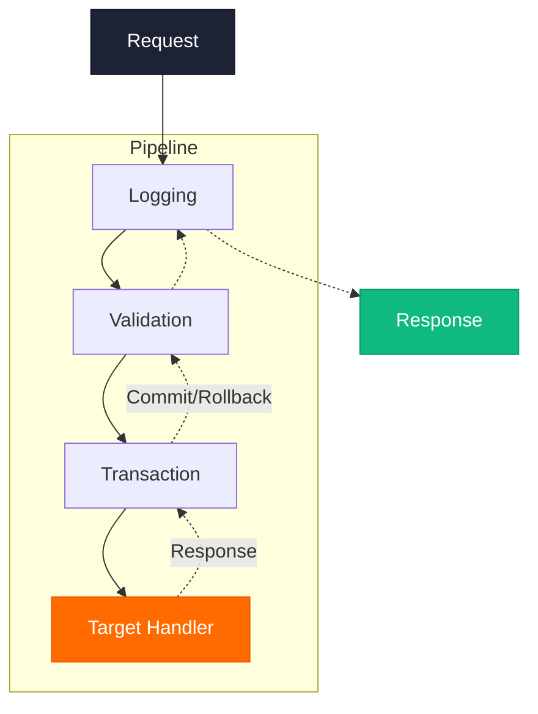
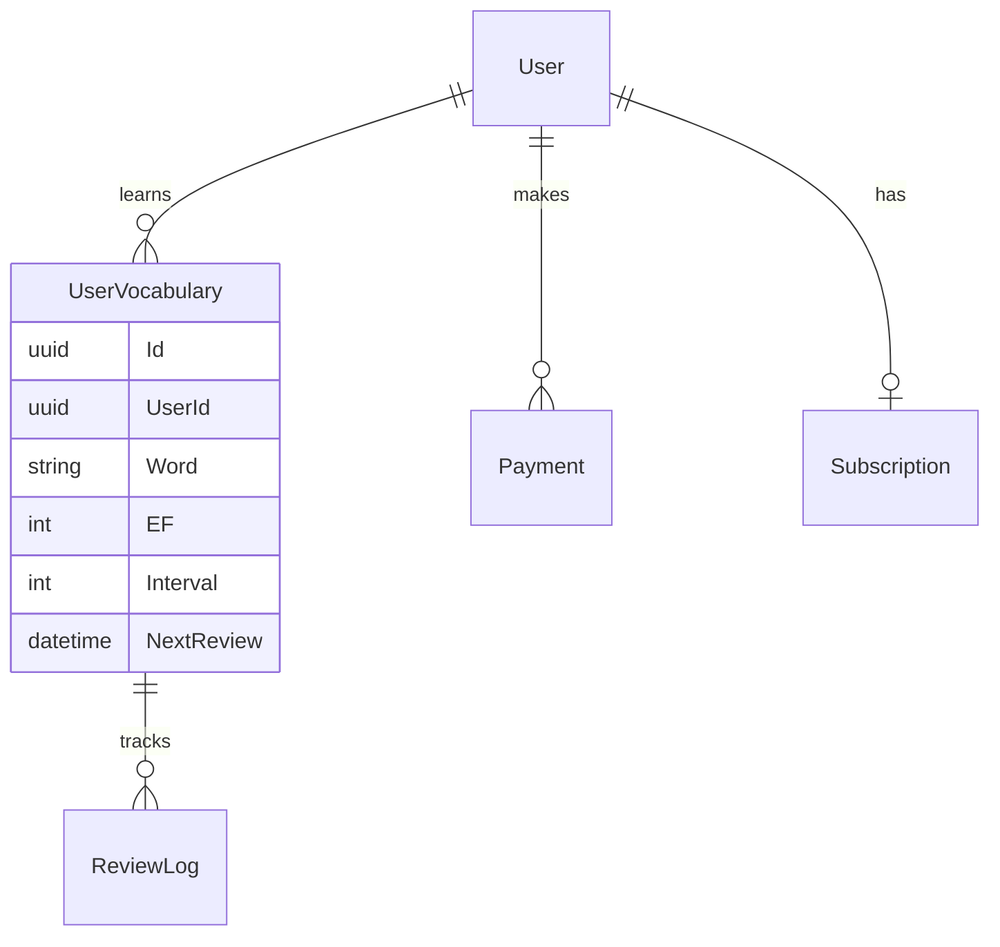
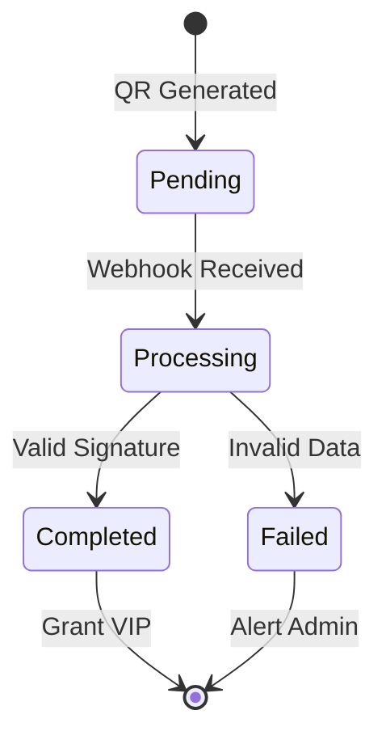

L

LexiVocab

<h1 class="cover-tagline text-left max-w-3xl" v-motion :initial="{ opacity: 0, x: -30 }" :enter="{ opacity: 1, x: 0, transition: { delay: 300, duration: 800 } }">
Nền tảng học từ vựng   chủ động đa môi trường
</h1>

Ứng dụng thuật toán Spaced Repetition SuperMemo-2 và AI sinh tạo để mang lại trải nghiệm liền mạch, tập trung.

Phan Văn Thành

Sinh viên thực hiện (DTH225766)

Ths. Nguyễn Thái Dư

Giảng viên hướng dẫn

---
transition: slide-up
---

TẦM NHÌN DỰ ÁN

<h1 class="animate-fade-up animate-delay-1 mb-2 text-3xl">Mục tiêu đồ án</h1>

Xây dựng sản phẩm hoàn thiện, giải quyết triệt để bài toán học từ vựng của người dùng.

  <!-- Card 1: Multi-platform -->
  

    

      

    

    

      <h3 class="font-bold text-gray-900 mb-0.5 text-sm">Hệ sinh thái Đa nền tảng</h3>
      
Trải nghiệm liền mạch qua Extension, Web & Mobile.

    

  

  <!-- Card 2: Spaced Repetition -->
  

    

      

    

    

      <h3 class="font-bold text-gray-900 mb-0.5 text-sm">SuperMemo-2</h3>
      
Thuật toán tính chu kỳ ôn tập khoa học, cá nhân hóa.

    

  

  <!-- Card 3: AI -->
  

    

      

    

    

      <h3 class="font-bold text-gray-900 mb-0.5 text-sm">AI Sinh tạo</h3>
      
Tích hợp LLM tạo ngữ cảnh, dịch thuật tự động.

    

  

  <!-- Card 4: Production-Ready -->
  

    

      

    

    

      <h3 class="font-bold text-gray-900 mb-0.5 text-sm">Triển khai thực tế</h3>
      
Hệ thống Production-ready, chạy mượt mà trên môi trường thật.

    

  

<BrandFooter section="Mở đầu" />

---
transition: fade
---

<!-- Left Side: Context -->

BỐI CẢNH

<h1 class="animate-fade-up animate-delay-1 text-4xl leading-tight mb-4">Thực trạng thị trường</h1>

Các ứng dụng hiện tại (Anki, Quizlet) thiếu tính liền mạch, tạo ra khoảng trống lớn trong trải nghiệm người dùng.

Cơ hội cho hệ sinh thái hợp nhất giải quyết triệt để <strong>Context Switching</strong>.

<!-- Right Side: Bento Grid -->

1.5 Tỷ

Người học tiếng Anh toàn cầu

80%

Khó khăn với từ mới

$404B

Thị trường EdTech 2025

<BrandFooter section="Bối cảnh" />

---
transition: slide-up
---

RÀO CẢN #1

<!-- Left Side -->

<h1 class="animate-fade-up animate-delay-1 text-4xl leading-tight mb-2">Context Switching</h1>
<h2 class="text-[var(--lv-primary)] mb-6 animate-fade-up animate-delay-2 text-xl font-semibold">Kẻ thù của sự tập trung</h2>

Chuyển đổi qua lại giữa bài báo và ứng dụng từ điển làm đứt đoạn luồng tư duy, tạo ra cảm giác nản chí khi đọc tài liệu ngoại ngữ.

Mất 23 phút

để não bộ lấy lại sự tập trung và quay về trạng thái "Flow" sau mỗi lần gián đoạn.

— Nghiên cứu từ ĐH UC Irvine

<!-- Right Side Visual -->

<!-- Distraction Metric -->

-40%

Hiệu suất

<BrandFooter section="Vấn đề" />

---
transition: fade
---

RÀO CẢN #2

<h1 class="animate-fade-up animate-delay-1 mb-2">Đường cong quên lãng</h1>

Học vẹt không ôn tập dẫn đến lãng phí công sức. Nếu không ôn tập đúng thời điểm, não bộ sẽ tự động loại bỏ thông tin để nhường chỗ cho dữ liệu mới.

  <ForgetCurve />

  

    
60%

    
Quên sau 1 giờ

  

  

    
80%

    
Quên sau 24 giờ

  

  

    
90%

    
Quên sau 1 tuần

  

<BrandFooter section="Vấn đề" />

---
transition: slide-up
---

GIẢI PHÁP

<h1 class="animate-fade-up animate-delay-1 mb-16 text-5xl font-black tracking-tight">Ba Trụ Cột của LexiVocab</h1>

<PillarCard 
number="1" 
title="Bắt từ" 
enTitle="Capture"
icon="i-lucide-scan-line"
desc="Chrome Extension bắt từ vựng trực tiếp trên trang web, không làm gián đoạn luồng đọc và tư duy của bạn."
delay="400" 
/>

<PillarCard 
number="2" 
title="Nhớ lâu" 
enTitle="Remember"
icon="i-lucide-brain"
desc="Thuật toán SuperMemo-2 tối ưu hóa thời gian ôn tập, giúp chuyển thông tin từ bộ nhớ ngắn hạn sang dài hạn."
delay="600" 
/>

<PillarCard 
number="3" 
title="Hiểu sâu" 
enTitle="Understand"
icon="i-lucide-sparkles"
desc="Tận dụng sức mạnh của AI để tạo ngữ cảnh cá nhân hóa, ví dụ thực tế giúp bạn hiểu cặn kẽ mọi tầng nghĩa."
delay="800" 
/>

<BrandFooter section="Giải pháp" />

---
layout: cover
class: "!p-0 bg-[#09090B] text-white"
---

<SectionDivider 
number="02" 
title="Hệ Sinh Thái 4 Mảnh Ghép" 
desc="Kiến trúc Hub & Spoke kết nối đa nền tảng, bao phủ 100% không gian thiết bị." 
/>

---
transition: fade
---

ARCHITECTURE

<h1 class="animate-fade-up animate-delay-1 mb-4 text-left">Kiến trúc Hub & Spoke</h1>

<HubSpoke />

<BrandFooter section="Hệ sinh thái" />

---
transition: slide-up
---

CLIENT 1

<h1 class="animate-fade-up animate-delay-1">Chrome Extension</h1>
<h2 class="text-[#FF6B00] mb-6 animate-fade-up animate-delay-2">Công cụ "Bắt từ" tức thì</h2>

Tra từ và lưu trữ mà không cần rời khỏi trang web. Tối đa hóa sự tập trung.

01

<strong>Manifest V3:</strong> Chuẩn bảo mật mới nhất của Chrome.

02

<strong>Shadow DOM:</strong> Cô lập hoàn toàn UI popup khỏi CSS của website hiện tại, chống vỡ layout.

03

<strong>Service Worker:</strong> Tối ưu RAM, chỉ hoạt động khi gọi API background.

<!-- Browser header -->

nytimes.com/article

<!-- Browser content -->

The serendipity of the moment was not lost on the researchers.
 

<!-- Extension Popup Simulation -->

serendipity
NOUN

Sự tình cờ may mắn, khám phá ra thứ có giá trị khi không chủ đích tìm kiếm.

<button class="w-full bg-[#1D2235] text-white text-xs py-2 rounded-lg font-bold">Save to LexiVocab</button>

<BrandFooter section="Hệ sinh thái" />

---
transition: fade
---

CLIENT 2

  <h2 class="text-4xl font-black text-gray-900 mb-8 leading-tight">Học tập liền mạch, Mọi lúc mọi nơi.</h2>
  
  

    

      

        

      

      

        <h4 class="font-bold text-gray-900 text-lg">Đồng bộ Real-time</h4>
        
Dữ liệu đồng bộ tức thì với Cloud thông thông qua Core API Service.

      

    

    

      

        

      

      

        <h4 class="font-bold text-gray-900 text-lg">Nhắc nhở SRS Thông Minh</h4>
        
Thuật toán Spaced Repetition gửi thông báo đúng "thời điểm vàng" để ghi nhớ.

      

    

    

      

        

      

      

        <h4 class="font-bold text-gray-900 text-lg">Bento UI Modern</h4>
        
Giao diện hiện đại, tối ưu cho trải nghiệm một tay và đa nền tảng.

      

    

  

  

    

      

        

          

        

        
      

    

    

      

        

        LIVE DATA
      

      
100% Synced

    

  

<BrandFooter section="Hệ sinh thái" />

---
transition: slide-up
---

CLIENT 3

<h1 class="animate-fade-up animate-delay-1 mb-2">Web Dashboard</h1>

Next.js 14 App Router với Server Components tối ưu SEO và Analytics.

<h3 class="text-[#1D2235] font-bold text-sm mb-1">Analytics Reports</h3>

Sử dụng Recharts trực quan hóa: Tỷ lệ ghi nhớ, Streak days, Heatmap.

<h3 class="text-[#1D2235] font-bold text-sm mb-1">Thanh toán tự động</h3>

Tích hợp Webhook SePay chống duplicate events bằng Idempotency.

<h3 class="text-[#1D2235] font-bold text-sm mb-1">Đa ngôn ngữ (i18n)</h3>

Hỗ trợ 4 ngôn ngữ UI, mở rộng quy mô quốc tế dễ dàng.

<BrandFooter section="Hệ sinh thái" />

---
transition: view-transition
---

<SectionDivider 
number="03" 
title="Kiến trúc Backend & Bảo mật" 
desc="Clean Architecture, CQRS, và cơ chế xác thực kép đảm bảo hiệu năng cốt lõi." 
/>

---
transition: slide-up
---

ARCHITECTURE

<h1 class="animate-fade-up animate-delay-1 mb-2">Clean Architecture</h1>
<h2 class="text-[#FF6B00] mb-6 animate-fade-up animate-delay-2">Core API .NET 10</h2>

Tách biệt logic cốt lõi khỏi framework và cơ sở dữ liệu.

<strong>Dependency Rule:</strong> Các dependency chỉ được hướng vào trong. Domain Layer ở trung tâm chứa business logic thuần túy.

 Dễ dàng mở rộng, thay đổi Database mà không cần sửa Core Logic.

<LayerDiagram />

<BrandFooter section="Backend" />

---
transition: fade
---

PATTERN

<h1 class="animate-fade-up animate-delay-1 mb-2">CQRS</h1>

Phân tách rõ ràng thao tác Ghi và Đọc để tối ưu hóa riêng biệt.

<!-- Command Side -->

<h3 class="font-bold text-[#1D2235] mb-4 flex items-center gap-2">

 Command (Ghi)
</h3>
<ul class="text-sm space-y-2 mb-4 text-gray-600 font-mono">
<li>CreateFlashcardCommand</li>
<li>UpdateReviewResultCommand</li>
</ul>

Thực thi validation phức tạp. Ghi vào Primary DB.

<!-- Query Side -->

<h3 class="font-bold text-[#1D2235] mb-4 flex items-center gap-2">

 Query (Đọc)
</h3>
<ul class="text-sm space-y-2 mb-4 text-gray-600 font-mono">
<li>GetDueFlashcardsQuery</li>
<li>GetUserStatisticsQuery</li>
</ul>

Tối ưu tốc độ đọc, không side-effects. Có thể scale Read Replica.

<BrandFooter section="Backend" />

---
transition: slide-up
---

MEDIATR

<h1 class="animate-fade-up animate-delay-1 mb-2">MediatR & Pipeline</h1>
<h2 class="text-[#FF6B00] mb-6 animate-fade-up animate-delay-2">Xử lý Cross-cutting Concerns</h2>

Điều phối Command/Query đến đúng Handler tương ứng.

1

LoggingBehavior → Ghi log I/O

2

ValidationBehavior → FluentValidation

3

TransactionBehavior → Auto Commit/Rollback

4

CommandHandler / QueryHandler

<BrandFooter section="Backend" />

---
transition: fade
---

BẢO MẬT

<h1 class="animate-fade-up animate-delay-1 mb-2">Stateful Identity</h1>

Cơ chế xác thực kép chống tấn công XSS hiệu quả, UX liền mạch.

<TokenFlow />

<BrandFooter section="Bảo mật" />

---
transition: slide-up
---

DATA LAYER

<h1 class="animate-fade-up animate-delay-1 mb-2">Database Design</h1>
<h2 class="text-[#FF6B00] mb-6 animate-fade-up animate-delay-2">PostgreSQL & EF Core 9</h2>

Thiết kế schema chuẩn hóa với Code First Migration.

<strong>PostgreSQL:</strong> Tận dụng sức mạnh xử lý JSONB và Full-text search.

<strong>EF Core 9:</strong> ORM mạnh mẽ nhất hệ sinh thái .NET.

<strong>Soft Delete:</strong> Dữ liệu không bị xóa vật lý (IsDeleted cờ). Đảm bảo toàn vẹn dữ liệu.

<BrandFooter section="Backend" />

---
transition: view-transition
---

<SectionDivider 
number="04" 
title="Use-Cases & Xử lý tải" 
desc="Thuật toán lõi, tối ưu truy vấn Database, và kỹ thuật Streaming AI." 
/>

---
transition: slide-up
---

CORE ALGORITHM

<h1 class="animate-fade-up animate-delay-1 mb-2">Thuật toán SuperMemo-2</h1>
<h2 class="text-[#FF6B00] mb-6 animate-fade-up animate-delay-2">Trái tim của hệ sinh thái</h2>

Tính toán thời điểm hoàn hảo để ôn tập trước khi não bộ kịp quên.

EF' = EF + (0.1 - (5-q) * (0.08 + (5-q) * 0.02)) 
I(n) = I(n-1) * EF

Khó (0-2)

Ôn sau: 1-3 ngày

Dễ (3-5)

Ôn sau: 1-4 tháng

<h3 class="font-bold text-center mb-6">Mô phỏng chu kỳ</h3>
<TimelineFlow />

 Fuzz Factor (Cải tiến)

Tránh hiện tượng Review Hell (hàng loạt thẻ dồn lại một ngày).

<BrandFooter section="Use Cases" />

---
transition: fade
---

PERFORMANCE OPTIMIZATION

<h1 class="animate-fade-up animate-delay-1 mb-2">B-Tree Indexing</h1>

Tối ưu hóa câu truy vấn: "Lấy thẻ cần ôn hôm nay".

<!-- Before -->

<h3 class="font-bold text-[#1D2235] mb-2 text-center text-red-500">Trước khi tối ưu (Full Scan)</h3>

SELECT * FROM "Flashcards" 
WHERE "NextReviewDate" <= NOW()

Thời gian (10K user)

~500 ms

<!-- After -->

99.9% FASTER

<h3 class="font-bold text-[#1D2235] mb-2 text-center text-green-500">Thêm Composite Index</h3>

CREATE INDEX IX_NextReview  
ON "Flashcards" ("UserId", "NextReviewDate")

Thời gian (10K user)

&lt; 1 µs

<BrandFooter section="Use Cases" />

---
transition: slide-up
---

REALTIME AI

<h1 class="animate-fade-up animate-delay-1 mb-2">AI Streaming (SSE)</h1>
<h2 class="text-[#FF6B00] mb-6 animate-fade-up animate-delay-2">Trải nghiệm Zero-delay</h2>

Server-Sent Events đẩy dữ liệu text ngay lập tức, không bắt user chờ đợi 5s.

<table class="compare-table">
<thead>
<tr>
<th>Tiêu chí</th>
<th>WebSockets</th>
<th>SSE (LexiVocab)</th>
</tr>
</thead>
<tbody>
<tr>
<td>Giao tiếp</td>
<td>2 chiều (Duplex)</td>
<td><strong class="text-[#FF6B00] flex items-center gap-2">

 1 chiều (Server → Client)</strong></td>
</tr>
<tr>
<td>Giao thức</td>
<td>Custom (ws://)</td>
<td><strong class="text-[#FF6B00]">HTTP thuần</strong></td>
</tr>
<tr>
<td>Tài nguyên</td>
<td>Nặng (Handshake)</td>
<td><strong class="text-[#FF6B00]">Nhẹ, tiết kiệm</strong></td>
</tr>
</tbody>
</table>

<StreamingText text='"Serendipity" — Sự tình cờ may mắn. Ví dụ, Alexander Fleming phát hiện ra Penicillin là một serendipity vĩ đại.' />

<BrandFooter section="Use Cases" />

---
transition: fade
---

GENERATIVE AI

<h1 class="animate-fade-up animate-delay-1 mb-2">Tích hợp LLM & Prompting</h1>

Kiến trúc AI hỗ trợ GPT-4, Claude, và Gemini qua Factory Pattern.

<h3 class="font-bold text-sm mb-2">Prompt Engineering</h3>

Few-shot prompting. Set <code>Temperature=0.7</code> cân bằng sáng tạo & chính xác.

<h3 class="font-bold text-sm mb-2">Đa dạng Use-cases</h3>

Giải nghĩa theo ngữ cảnh trang web, phân tích cấu trúc ngữ pháp phức tạp.

<h3 class="font-bold text-sm mb-2">Cost Optimization</h3>

Cache Redis các từ phổ biến. Batch API requests tối ưu Token.

<BrandFooter section="Use Cases" />

---
transition: slide-up
---

PAYMENT & JOBS

<h1 class="animate-fade-up animate-delay-1 mb-2">SePay & Idempotency</h1>

Xử lý webhook thanh toán an toàn, chống Duplicate Transaction.

<h3 class="font-bold text-sm text-[#FF6B00] mb-2 flex items-center gap-2">

 Idempotency Pattern</h3>

Đánh <code>UNIQUE KEY</code> cột <code>TransactionId</code>. Khi SePay gửi trùng webhook do timeout, DB văng lỗi <code>23505</code>. <strong>Tuyệt đối không cộng VIP 2 lần.</strong>

<h2 class="animate-fade-up animate-delay-3 text-lg font-bold mb-2 flex items-center gap-2">

 Hangfire Background Jobs</h2>
<ul class="text-xs text-gray-600 space-y-2 animate-fade-up animate-delay-4 pl-4 list-disc">
<li><strong>SendReviewReminder:</strong> Push notification ôn bài.</li>
<li><strong>ProcessExpiredVIP:</strong> Hạ cấp account hết hạn.</li>
</ul>

<BrandFooter section="Use Cases" />

---
transition: view-transition
---

<SectionDivider 
number="05" 
title="Triển khai & DevOps" 
desc="Tối ưu Docker Image, thiết lập CI/CD Pipeline và triển khai trên hạ tầng Cloud." 
/>

---
transition: fade
---

DEPLOYMENT

<h1 class="animate-fade-up animate-delay-1 mb-2">Docker & Railway Ecosystem</h1>

Kiến trúc triển khai tự động hóa cao, tối ưu dung lượng.

<h3 class="font-bold text-[#1D2235] mb-4 flex items-center gap-2">

 Multi-stage Docker
</h3>

<strong>Stage 1 (Build):</strong> .NET SDK (~800MB) biên dịch code.

<strong>Stage 2 (Runtime):</strong> ASP.NET Runtime siêu nhẹ.

Giảm dung lượng Image từ 1GB xuống 200MB (-80%)

<h3 class="font-bold text-[#1D2235] mb-4 flex items-center gap-2">

 Railway PaaS
</h3>

<strong>CI/CD Tự động:</strong> Push code → Build & Deploy.

<strong>Auto-provisioning:</strong> Khởi tạo Postgres & Redis.

<strong>Health checks:</strong> Auto-restart khi crash.

<BrandFooter section="DevOps" />

---
transition: view-transition
---

<SectionDivider 
number="06" 
title="Live Demo" 
desc="Trải nghiệm thực tế hệ sinh thái LexiVocab qua 4 kịch bản sử dụng." 
/>

---
transition: slide-up
---

DEMONSTRATION

<h1 class="animate-fade-up animate-delay-1 mb-8">Kịch bản Demo</h1>

<!-- Demo 1 -->

1

<h3 class="font-bold text-[#1D2235] text-sm mb-1">Bắt từ vựng tức thì</h3>

Chrome Extension: Bôi đen từ khó trên web và lưu vào hệ thống qua Shadow DOM Popup.

<!-- Demo 2 -->

2

<h3 class="font-bold text-[#1D2235] text-sm mb-1">Ôn tập với SuperMemo-2</h3>

Mobile App: Vuốt flashcard, xem hệ thống tính toán Next Review Date real-time.

<!-- Demo 3 -->

3

<h3 class="font-bold text-[#1D2235] text-sm mb-1">AI Streaming (SSE)</h3>

Tính năng "Explain with AI": Trải nghiệm tốc độ streaming từng token như ChatGPT.

<!-- Demo 4 -->

4

<h3 class="font-bold text-[#1D2235] text-sm mb-1">Widget & Dashboard</h3>

Android Widget nền chờ, theo dõi Analytics Chart và i18n trên Web Dashboard.

 Bắt đầu trình diễn

<BrandFooter section="Live Demo" />

---
transition: view-transition
---

<SectionDivider 
number="07" 
title="Kết Luận" 
desc="Tổng kết đóng góp, định hướng phát triển và phần hỏi đáp Hội đồng." 
/>

---
transition: slide-up
---

SUMMARY

<h1 class="animate-fade-up animate-delay-1 mb-8">Tổng kết đóng góp</h1>

 Về Kiến trúc

<ul class="text-xs space-y-2 text-gray-600 list-disc pl-4">
<li>Clean Architecture, CQRS (MediatR).</li>
<li>Docker & CI/CD Pipeline.</li>
<li>Bảo mật Stateful Identity (HttpOnly Cookie).</li>
</ul>

 Về Trải nghiệm

<ul class="text-xs space-y-2 text-gray-600 list-disc pl-4">
<li>Cải tiến SuperMemo-2 + Fuzz Factor.</li>
<li>Giao tiếp 1 chiều tối ưu SSE (AI Streaming).</li>
<li>Shadow DOM bảo vệ UI Extension.</li>
</ul>

 Về Sản phẩm

<ul class="text-xs space-y-2 text-gray-600 list-disc pl-4">
<li>Hệ sinh thái đồng nhất Chrome, Mobile, Web.</li>
<li>Tích hợp SePay tự động với Idempotency.</li>
<li>Dashboard Analytics đa ngôn ngữ.</li>
</ul>

 LexiVocab đã đạt chuẩn Production-Ready với khả năng mở rộng mạnh mẽ.

<BrandFooter section="Kết luận" />

---
transition: fade
---

FUTURE ROADMAP

<h1 class="animate-fade-up animate-delay-1 mb-8">Hạn chế & Hướng phát triển</h1>

<h3 class="font-bold text-[#1D2235] mb-4 flex items-center gap-2">

 Hạn chế hiện tại
</h3>

Chưa hỗ trợ Offline Mode hoàn toàn.

Widget hiện chỉ hỗ trợ nền tảng Android.

Chi phí LLM API cao khi người dùng (DAU) lớn.

<h3 class="font-bold text-[#1D2235] mb-4 flex items-center gap-2">

 Tương lai
</h3>

Offline Mode với Service Worker + IndexedDB.

Phát triển iOS Widget bằng Native Modules (SwiftUI).

Tự host Fine-tuned model nhỏ (Llama 3B) giảm chi phí.

<BrandFooter section="Kết luận" />

---
layout: center
class: text-center
---

L

<h1 class="mb-4">Xin trân trọng cảm ơn!</h1>

Cảm ơn Quý Thầy Cô Hội đồng đã dành thời gian lắng nghe.

Sinh viên

Phan Văn Thành

DTH225766

Q&A

Mời Hội đồng

đặt câu hỏi

